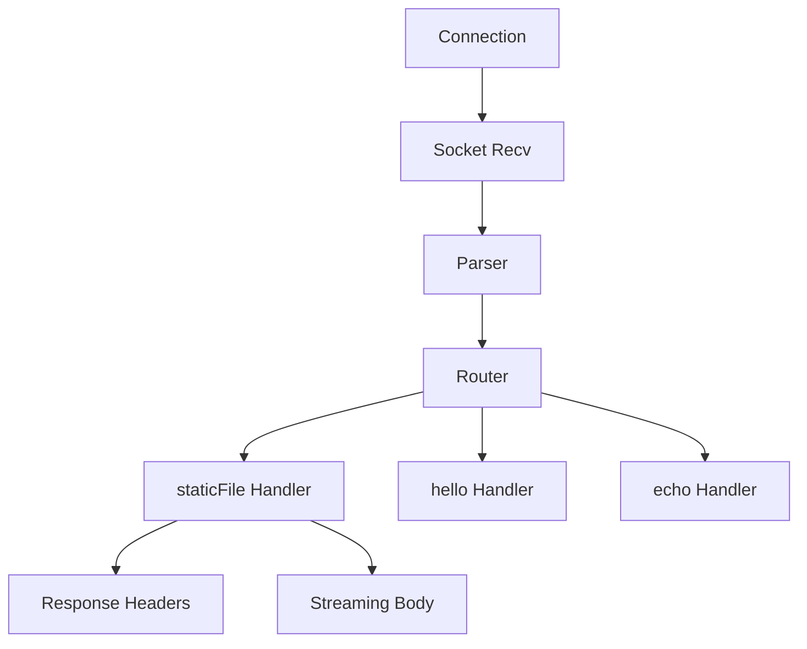

# System Architecture

This document describes the internal design and data flow of the Zig HTTP Server.

## Core Components

### 1. Connection Loop (`main.zig`)

The server uses a main loop that accepts TCP connections. Each connection is spawned into a `std.Thread.Pool`.

- **Timeouts**: To prevent hanging connections, `SO_RCVTIMEO` is set on both the listener (for graceful shutdown) and individual client sockets.
- **Graceful Shutdown**: A global atomic flag `running` is toggled by a Windows Console Ctrl Handler. The `accept()` call times out every second to check this flag.

### 2. Request Parsing (`http/parser.zig`)

The parser is designed for efficiency and safety.

- **Allocation Strategy**: It takes an `Allocator` to store parsed headers. In the server, this is always an `ArenaAllocator` associated with the specific request.
- **Header Storage**: Headers are stored as a slice of `Header` structs (`name` and `value` slices pointing into the original buffer).

### 3. Routing (`router.zig`)

The router acts as a dispatcher between the parsed request and the specific business logic in `handlers.zig`.

### 4. Handlers and Static Files (`handlers.zig`)

- **Streaming**: The `staticFile` handler uses a fixed 4KB buffer to read from disk and send directly to the socket, ensuring that serving a 1GB file doesn't consume 1GB of RAM.
- **Security**: The handler strictly checks for `..` in paths to prevent directory traversal attacks.

## Memory Management

The server uses a **Double-Allocator Pattern**:

1. **General Purpose Allocator (GPA)**: Used for long-lived structures like the `Thread.Pool`.
2. **Arena Allocator**: Created per-request. All temporary data (headers, full paths, etc.) is allocated here and freed in one go when the connection is handled.

## Performance Considerations

- **Buffer Reuse**: The server uses stack-allocated buffers for small reads to avoid heap churn.
- **Multithreading**: The job-based pool ensures that one slow client (e.g., slow file download) doesn't block other users.
- **Chunked Sending**: By sending headers and then streaming the body, we achieve lower latency (Time to First Byte).

## Future Improvements

- **TLS/SSL Implementation**: Integration of a TLS library for HTTPS support.
- **Route Parameters**: Support for dynamic routes like `/users/:id`.
- **Middleware Support**: A pipeline for authentication, compression (once std lib is updated), and error handling.
